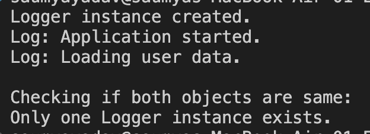

## Exercise 1: Implementing the Singleton Pattern

**Scenario:** 

You need to ensure that a logging utility class in your application has only one instance throughout the application lifecycle to ensure consistent logging.

**Steps:**
1. Create a New Java Project:
    - Create a new Java project named SingletonPatternExample.
2. Define a Singleton Class:
    - Create a class named Logger that has a private static instance of itself.
    - Ensure the constructor of Logger is private.
    - Provide a public static method to get the instance of the Logger class.
3. Implement the Singleton Pattern:
    - Write code to ensure that the Logger class follows the Singleton design pattern.
4. Test the Singleton Implementation:
    - Create a test class to verify that only one instance of Logger is created and used across the application.

**Output:**

</img>