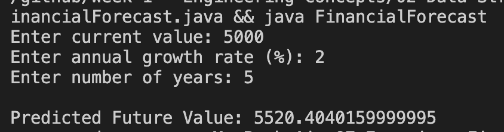

## Exercise 7: Financial Forecasting
**Scenario: **
You are developing a financial forecasting tool that predicts future values based on past data.
**Steps:**
1. Understand Recursive Algorithms:
    - Explain the concept of recursion and how it can simplify certain problems.
**Setup:**
    - Create a method to calculate the future value using a recursive approach.
**Implementation:**
    - Implement a recursive algorithm to predict future values based on past growth rates.
**Analysis:**
    - Discuss the time complexity of your recursive algorithm.
    - Explain how to optimize the recursive solution to avoid excessive computation.

**Assume:**
Current value = ₹10,000

Growth rate = 10% per year

Forecast for 5 years

Formula: Future Value = Present Value × (1 + Growth Rate)

