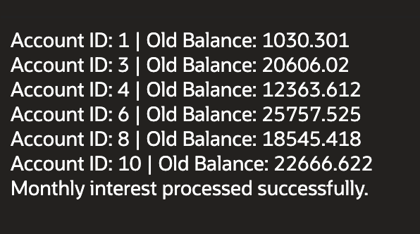
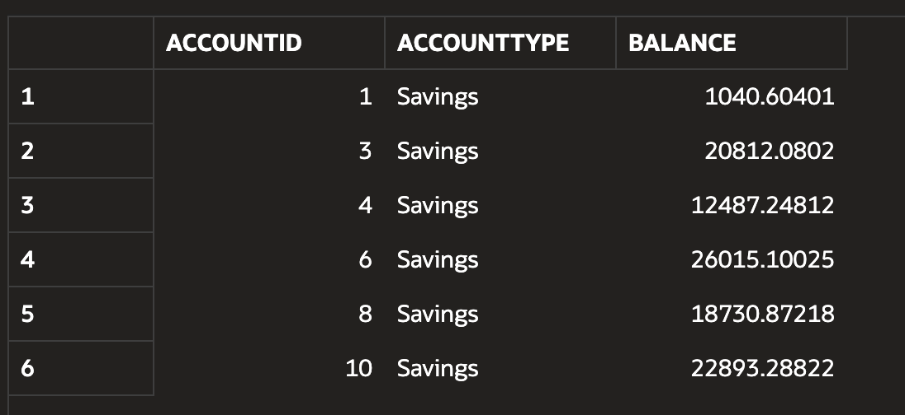
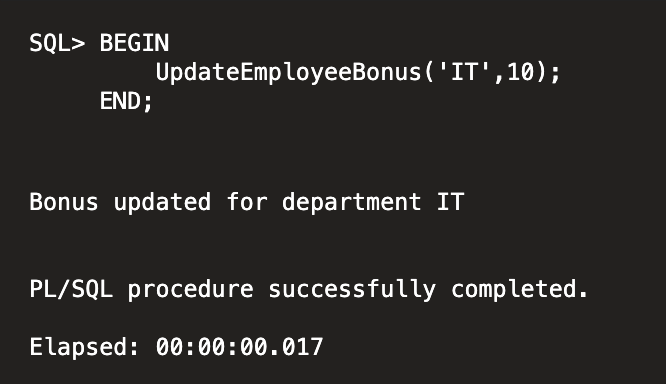
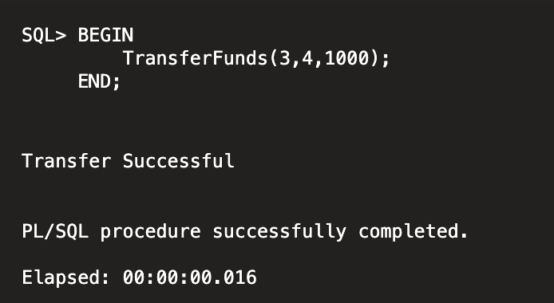

## Exercise 3: Stored Procedures

**Scenario 1:** The bank needs to process monthly interest for all savings accounts.

**Question:** Write a stored procedure **ProcessMonthlyInterest** that calculates and updates the balance of all savings accounts by applying an interest rate of 1% to the current balance.

**Output:**

---

**Scenario 2:** The bank wants to implement a bonus scheme for employees based on their performance.

**Question:** Write a stored procedure **UpdateEmployeeBonus** that updates the salary of employees in a given department by adding a bonus percentage passed as a parameter.

**Output:**

---

**Scenario 3:** Customers should be able to transfer funds between their accounts.

**Question:** Write a stored procedure **TransferFunds** that transfers a specified amount from one account to another, checking that the source account has sufficient balance before making the transfer.

**Output:**

