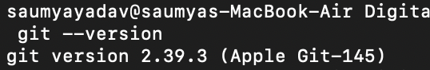
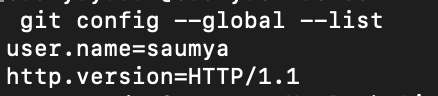
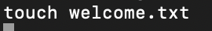
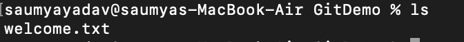
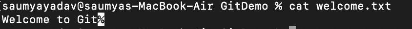
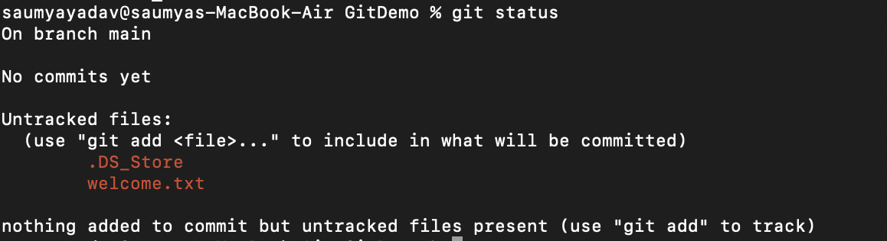
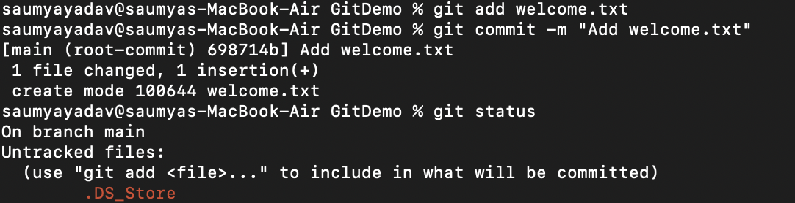
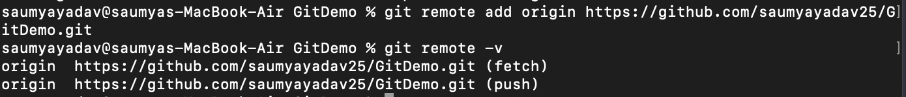
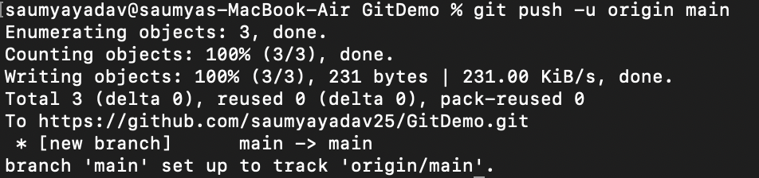

## Objectives

Familiar with Git commands like git init, git status, git add, git commit, git push, and git pull.

In this hands-on lab, you will learn how to
- Setup your machine with Git Configuration
- Integrate notepad++.exe to Git and make it a default editor
- Add a file to source code repository

1. Check Git Installation



2. Configure Git



3. Create Repository


4. Create File



5. Verify



6. Read file



7. Check Status



8. Add, commit, check status again



9. Create Remote Repository

Create a repository named **GitDemo** on GitHub or GitLab.

Connect it and verify



10. Push



## Commands Covered in this HOL

```
git --version
git config --global user.name "Your Name"
git config --global user.email "your@email.com"
git config --list
git init
git status
git add welcome.txt
git commit -m "Add welcome.txt"
git remote add origin <repository-url>
git pull origin main
git push -u origin main
```