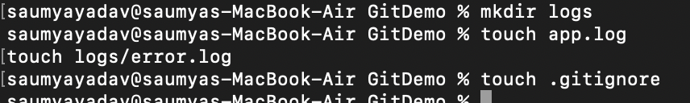
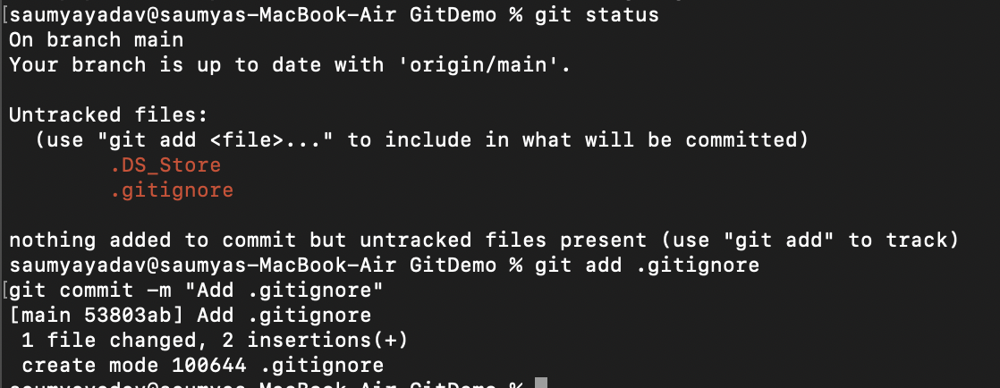

## Objectives

- Explain git ignore
- Explain how to ignore unwanted files using git ignore

Create a “.log” file and a log folder in the working directory of Git. Update the .gitignore file in such a way that on committing, these files (.log extensions and log folders) are ignored.

Verify if the git status reflects the same about working directory, local repository and git repository. 

- 1. Create a log folder
- 2. Create some log files
- 3. Create `.gitignore`
- 4. Add these to gitignore: 
```
*.log
logs/
```

Meaning
```
*.log   → Ignore every file ending with .log
logs/   → Ignore the entire logs folder
```



- 5. Check status and commit .gitignore



## Commands Used
```
mkdir logs
touch app.log
touch logs/error.log
touch .gitignore
git status
git add .gitignore
git commit -m "Add .gitignore"
```