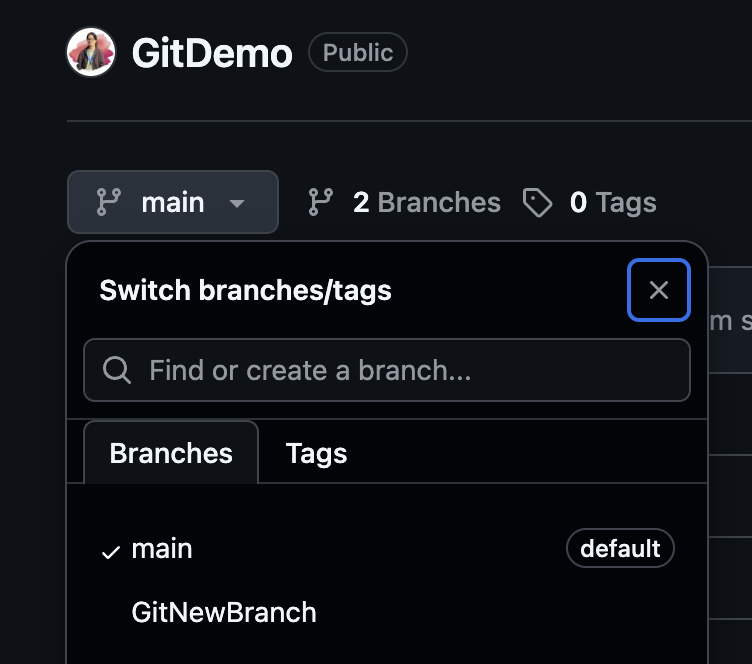

## Objectives

- Explain branching and merging  
- Explain about creating a branch request in GitLab
- Explain about creating a merge request in GitLab

In this hands-on lab, you will learn how to:
- Construct a branch, do some changes in the branch, and merge it with master (or trunk)

1. Branching: 
- Create a new branch “GitNewBranch”. 
- List all the local and remote branches available in the current trunk. Observe the “*” mark which denote the current pointing branch. 
- Switch to the newly created branch. Add some files to it with some contents.
- Commit the changes to the branch.
- Check the status with “git status” command.

2. Merging: 
- Switch to the master
- List out all the differences between trunk and branch. These provide the differences in command line interface.
- List out all the visual differences between master and branch using P4Merge tool.
- Merge the source branch to the trunk.
- Observe the logging after merging using “git log –oneline –graph –decorate”
- Delete the branch after merging with the trunk and observe the git status.



## Commands covered in this HOL
```
git branch GitNewBranch
git branch -a
git checkout GitNewBranch
touch branch.txt
git add .
git commit -m "Added branch.txt"
git status
git checkout main
git diff main GitNewBranch
git merge GitNewBranch
git log --oneline --graph --decorate
git branch -d GitNewBranch
```