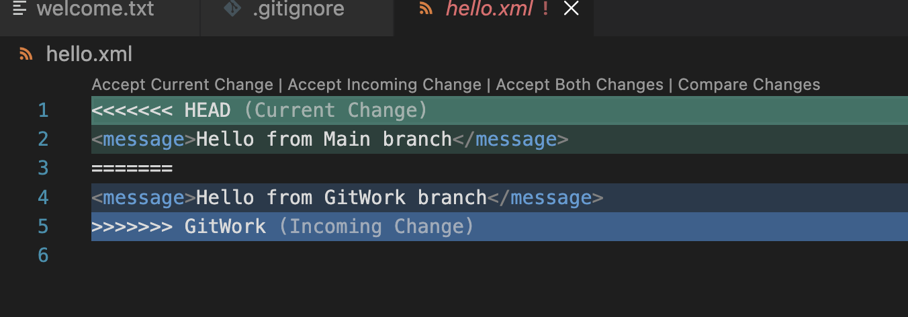
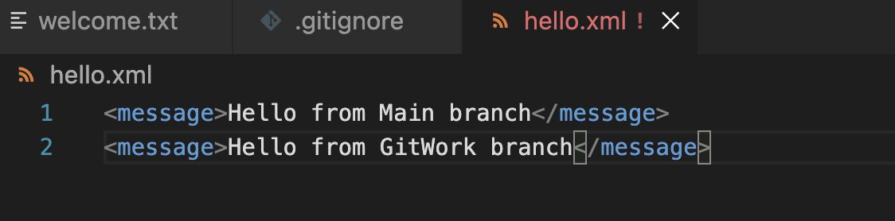

## Objectives

Explain how to resolve the conflict during merge.

In this hands-on lab, you will learn how to:
- Implement conflict resolution when multiple users are updating the trunk (or master) in such a way that it results into a conflict with the branch’s modification.


1. Verify if master is in clean state.
2. Create a branch “GitWork”. Add a file “hello.xml”.
3. Update the content of “hello.xml” and observe the status
4. Commit the changes to reflect in the branch
5. Switch to master.
6. Add a file “hello.xml” to the master and add some different content than previous.
7. Commit the changes to the master
8. Observe the log by executing “git log –oneline –graph –decorate –all”
9. Check the differences with Git diff tool
10. For better visualization, use P4Merge tool to list out all the differences between master and branch
11. Merge the bran to the master
12. Observe the git mark up.
13. Use 3-way merge tool to resolve the conflict
14. Commit the changes to the master, once done with conflict 
15. Observe the git status and add backup file to the .gitignore file.
16. Commit the changes to the .gitignore
17. List out all the available branches
18. Delete the branch, which merge to master.
19. Observe the log by executing “git log –oneline –graph –decorate”
 




## Command sequence
```
git switch main
git status
git push origin main

git checkout -b GitWork
git push -u origin GitWork

touch hello.xml
echo "<message>Hello from GitWork branch</message>" > hello.xml
git add hello.xml
git commit -m "Added hello.xml in GitWork"
git push

git switch main
echo "<message>Hello from Main branch</message>" > hello.xml
git add hello.xml
git commit -m "Added hello.xml in main"
git push origin main

git log --oneline --graph --decorate --all
git diff main GitWork

git merge GitWork
# Resolve conflict in hello.xml

git add hello.xml
git commit -m "Resolved merge conflict"
git push origin main

echo "*.orig" >> .gitignore
git add .gitignore
git commit -m "Ignore backup files"
git push origin main

git branch
git branch -d GitWork
git push origin --delete GitWork

git log --oneline --graph --decorate
```