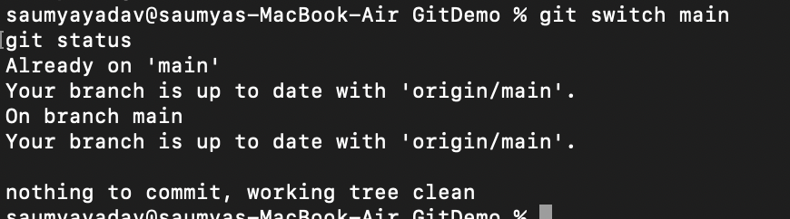
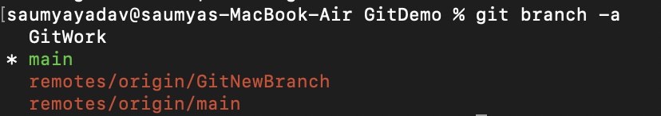
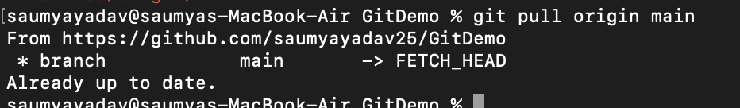
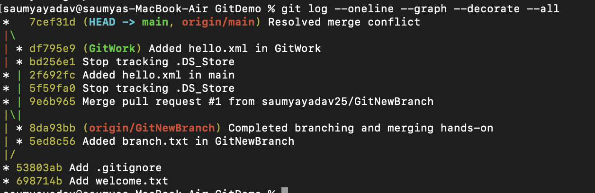
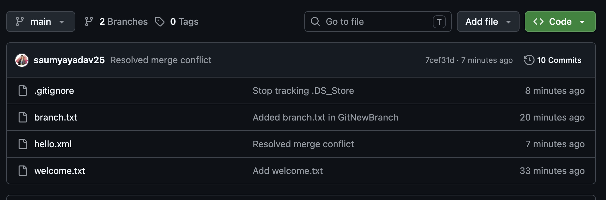

## Objectives

Explain how to clean up and push back to remote Git

In this hands-on lab, you will learn how to:
Execute steps involving clean up and push back to remote Git.

- Verify if master is in clean state.



- List out all the available branches.



- Pull the remote git repository to the master



- Push the changes to the remote repository. (already up to date, so not needed). otherwise run `git push origin main`
- Observe if the changes are reflected in the remote repository.





##Complete command list
```
git switch main
git status

git branch -a

git pull origin main

git push origin main

git log --oneline --graph --decorate --all
```